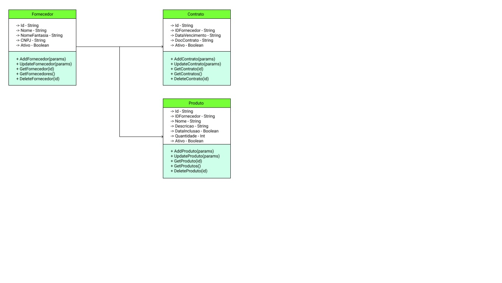

# CRUD---Fornecedores

Um simples CRUD feito com Nodejs, Bootstrap, HTML5 e CSS3 com seu sistema de grids.

## Instalação

* Baixar o NPM e o Node

* Abrir o projeto em uma IDE de preferência ou no terminal do sistema operacional

  * `npm install`

  * `json-server -p 3000 db.json`

  * `npm start`
  * `npm run dev`
  
* Caso a aplicação rode normalmente, estará disponível em `localhost:3000`
* Diagrama UML

